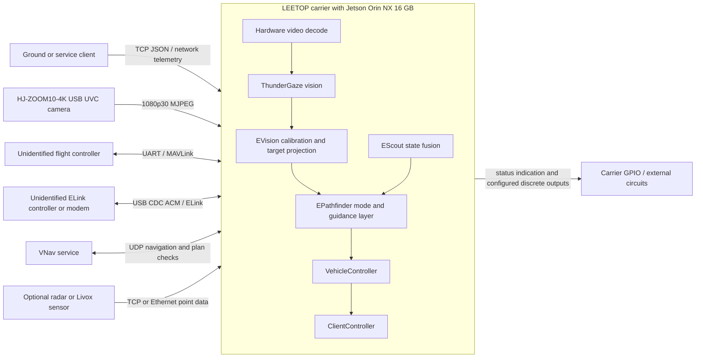

# EPathfinder: Gerbera onboard autonomy stack

Inside the recovered Gerbera aircraft, an NVIDIA Jetson Orin NX sits at the
junction of the camera, flight controller, navigation services, and
communication links. **EPathfinder is the application that turns this companion
computer into the aircraft's perception and mission layer.** It decodes video,
consumes flight telemetry, fuses navigation inputs, processes road and target
observations, manages mission state, and issues high-level requests to a
separate autopilot.

Gerbera is an expendable fixed-wing unmanned aircraft family documented in
false-target, reconnaissance, and one-way-attack/"kamikaze" roles. The two
aircraft examined here use the same core computing and imaging architecture:
the Jetson performs the outer perception, navigation, and mission functions,
while an unidentified flight controller remains responsible for stabilization
and physical actuator output. Additional serial, USB, UDP, and TCP paths connect
the Jetson to the camera, ELink, VNav, service clients, and optional sensors.

This repository reconstructs that Jetson application as compiling source and
documents the surrounding hardware as a system. It is not the complete aircraft
firmware, an airframe design, or a claim that every supported peripheral was
installed. Platform attribution comes from the forensic case context—the
application does not self-identify as Gerbera—so the documentation consistently
separates observed hardware, configured interfaces, optional capabilities, and
unknown components.

## Confirmed onboard computer and imaging stack

Both recovered aircraft use the same core architecture:

| Function | Observed hardware | Confidence |
|---|---|---|
| Companion computer | NVIDIA Jetson Orin NX 16 GB, module P3767-0000, Tegra234 SKU 211, eight CPU cores; photographed module PN `900-13767-0000-000` | Confirmed by operating-system identification and module markings |
| Physical carrier | LEETOP board marked PN `900-14887-0000`, Rev. 2.1, dated 2023-07-26 | Manufacturer, marked PN, and revision confirmed photographically; layout is consistent with the LEETOP A603 V2.1 family |
| Carrier software configuration | NVIDIA P3768-0000 Orin Nano reference-carrier configuration | Confirmed in both operating-system images; this identifies the board-support configuration, not the physical carrier manufacturer |
| Cooling | Carrier-mounted active fan and heat spreader | Confirmed photographically |
| Camera | USB UVC 1.10 device `HJ-ZOOM10-4K`, USB VID:PID `32e4:9415` | Confirmed descriptor; image sensor and lens are unknown |
| Operational video mode | 1,920 × 1,080 pixels, 30 frames/s, MJPEG, Jetson hardware decode | Confirmed; 4K operation was not observed |
| Wi-Fi/Bluetooth | Intel Dual Band Wireless-AC 8265, PCI ID `8086:24fd`, with integrated Bluetooth | Confirmed |
| Wired Ethernet | Realtek RTL8111/8168/8411 family, PCI ID `10ec:8168`, `r8168` driver | Family confirmed; exact silicon revision unknown |
| NVMe controller | MAXIO MAP1202, PCI ID `1e4b:1202`, PCIe Gen3 ×2 | Confirmed |
| Primary storage, unit 12702 | KingSpec NE-128 2242, 128 GB M.2-2242 NVMe | Model and device serial confirmed |
| Primary storage, unit 12674 | 128 GB NVMe using MAXIO MAP1202 | Capacity/controller confirmed; retail model and serial unknown |
| Primary flight-controller path | Tegra UART `ttyTHS1`, exposed as `/dev/ttyAP` | Confirmed interface; flight-controller PCB unknown |
| Secondary controller/ELink path | USB CDC ACM, exposed as `/dev/ttyFC`; rules expect STMicroelectronics USB VCP `0483:5740` | Confirmed interface expectation; attached PCB unknown |
| USB expansion | Four-port high-speed USB 2.0 hub | Confirmed; hub controller unknown |

NVIDIA documents P3767-0000 as the production Jetson Orin NX 16 GB module and
P3768-0000 as an Orin Nano reference-carrier configuration. The latter is the
software/board-support identity seen on disk; the supplied photographs resolve
the actual carrier manufacturer to LEETOP. Its connector layout and revision
match the LEETOP A603 V2.1 manual, but the photographed PN
`900-14887-0000` differs from the current A603 catalog number
`900-44887-0000`. The commercial A603 designation is therefore high-confidence,
while the photographed manufacturer, PN, and revision are confirmed. The
KingSpec NE series is an M.2-2242, PCIe Gen3 ×2 NVMe family, and Intel documents
the AC 8265 as a 2×2 Wi-Fi 5 adapter with integrated Bluetooth 4.2. See the
[forensic hardware inventory](docs/FORENSIC_HARDWARE.md) for unit-specific
evidence and exclusions.

### Physically populated carrier assembly

The photographs and operating-system evidence establish the following populated
assembly:

- the P3767 module is seated in the carrier's 260-contact Jetson connector and
  cooled by the photographed fan/heat-spreader assembly;
- an Intel 8265NGW occupies the M.2 Key E 2230 position; its Wi-Fi function is
  PCIe and its Bluetooth function is USB;
- a 128 GB NVMe device occupies the M.2 Key M 2242 position; the unit-12702
  storage identifies as KingSpec NE-128 2242;
- the carrier exposes Realtek Gigabit Ethernet, USB host/device connections,
  a CSI connector, CAN, a 40-position expansion header, and a two-pole DC input;
  these are board facilities, not proof that every connector was used;
- the running systems enumerated the UVC camera, a four-port USB 2.0 hub, and a
  USB CDC ACM device in addition to the onboard PCIe devices;
- the exact carrier connectors and wire colors used for `/dev/ttyAP`,
  `/dev/ttyFC`, the camera, and the five configured discrete lines cannot be
  derived from the photographs or storage images.

## How the aircraft electronics fit together



The normal information path is:

1. The flight controller supplies attitude, GNSS, airspeed, RC, system status,
   mission state, range, and related telemetry over MAVLink.
2. `EScout` time-aligns and fuses flight-controller, ELink, VNav, road,
   odometry, and optional exact-heading observations.
3. The UVC camera feeds the Jetson media pipeline. ThunderGaze produces target
   and road observations; `EVision` converts image coordinates to angular
   measurements using the 1,920 × 1,080 calibration grid.
4. `EPathfinder` combines mission state, fused navigation, and vision results
   into high-level modes and control requests.
5. MAVLink control handlers send mission, parameter, gimbal, and controller
   traffic back to the separate flight controller. The low-level actuator
   loops remain inside that unidentified controller.
6. ELink and network paths exchange vehicle state, plan data, remote-control
   state, targets, and launcher/configurator status.
7. `ClientController` exposes the local service API; `VehicleController`
   translates requests into vehicle state and subsystem operations.

The exact electrical circuits driven by configured GPIO line numbers are not
recoverable from storage. The settings identify red/green indicators and
arm/execute-related discrete lines, but do not establish connector pins,
voltage levels, isolation, external loads, or the airframe numbering scheme.

## Configured and optional peripherals

The checked-in configuration selects `/dev/video0`, `/dev/ttyAP`, and
`/dev/ttyFC`; enables VNav; and leaves the backup UART, radar, remote-controller,
tablet, and odometry endpoints unset or disabled. The software also contains:

- a SIYI ZR10 Ethernet/UART gimbal-camera backend; this is supported code, not
  the camera observed in either recovered aircraft;
- Livox SDK 2.3.0 and a point-clustering adapter; no installed Livox model is
  established by the two storage images;
- radar/interceptor and remote-controller TCP clients whose configured
  addresses are empty;
- serial, UDP, and TCP transport abstractions;
- a proprietary ELink stack and UDP telemetry transport;
- VNav plan validation, AHRS correction, target, road-point, and odometry
  datagrams;
- GPIO/LED abstractions and launch/execute control surfaces whose external
  circuitry is unknown.

## What remains unidentified

Neither storage image identifies the flight-controller make/model, GNSS
receiver, IMU, compass, barometer, propulsion system, engine controller, power
system, antennas, airframe construction, camera sensor/lens, or any terminal
payload, fuze, or warhead hardware. A configured Sony IMX219 device-tree node
does not constitute installed hardware: its I²C probe failed and it was not the
operational camera. No Quectel cellular modem was detected.

## Reconstruction status

This tree is a compiling source reconstruction with all identified application
component boundaries represented. Protocol, record-layout, mathematical,
camera, link, MAVLink, ELink, VNav, and state-management paths have executable
tests. It is not a statement-equivalent production replacement.

The current executable directly instantiates the TCP client service,
`VehicleController`, `EScout`, and `EPathfinder`. Peripheral classes are built
and tested, but the present `VehicleController::Init()` does not yet construct
the production MAVLink, ELink, vision, VNav, Livox, radar, or GPIO object graph.
ThunderGaze version-specific payload decoding, large road-matching routines,
autonomous flight laws, tablet serial transport, and deployment-specific host
actions remain bounded implementations. See [implementation status and
assumptions](RECOVERY_STATUS.md).

## Build and test

The Livox SDK 2.3.0 and MAVLink C headers are Git submodules. Clone the
repository with its dependencies:

```sh
git clone --recurse-submodules <repository-url>
```

For an existing checkout, initialize the pinned dependency revisions with:

```sh
git submodule update --init --recursive
```

Then configure, build, and test:

```sh
cmake -S . -B build -G Ninja
cmake --build build -j4
ctest --test-dir build --output-on-failure
```

Run the reconstructed service with:

```sh
./build/epathfinder_reconstructed
```

By default it reads `versions.json` and `settings.json` and exposes the local
TCP service on port 8052.

## Documentation

- [Forensic hardware inventory](docs/FORENSIC_HARDWARE.md)
- [Hardware and interface wiring](docs/HARDWARE_ARCHITECTURE.md)
- [Software component architecture](analysis/DECOMPOSITION.md)
- [Source-component coverage map](analysis/RECOVERED_UNITS.md)
- [Implementation status, assumptions, and quality gates](RECOVERY_STATUS.md)
- [Qt signal/slot interface inventory](analysis/generated/moc_interfaces.md)

## Primary external references

- [NVIDIA Jetson module and carrier table](https://docs.nvidia.com/jetson/archives/r36.4.3/DeveloperGuide/IN/QuickStart.html#jetson-modules-and-configurations)
- [NVIDIA Orin Nano/NX module part-number table](https://developer.download.nvidia.com/assets/embedded/secure/jetson/orin_nano/docs/Jetson-Orin-Nano-NX-CoV_DA-11856-001v01.pdf)
- [LEETOP A603 product specification](https://www.leetop.top/products/a603-carrier-board-for-orin-nx-orin-nano)
- [LEETOP A603 Carrier Board V2.1 manual](https://files.seeedstudio.com/Leetop_A603_Carrier_Board_V2.1%200228.pdf)
- [KingSpec NE 2242 NVMe specification](https://www.kingspec.com/product/m2-nvme-pcie-gen3-ssd-ne-2242mm.html)
- [Intel Wireless-AC 8265 specification](https://www.intel.com/content/www/us/en/products/sku/94150/intel-dual-band-wirelessac-8265/specifications.html)
- [ArduPilot MAVLink interface](https://ardupilot.org/dev/docs/mavlink-commands.html)
- [SIYI ZR10 specification](https://www.siyi.biz/en/product/tri-axis-single-camera-gimbal/zr10/spec/)
- [Livox SDK product support](https://www.livoxtech.com/sdk)
- [Gerbera platform record](https://war-sanctions.gur.gov.ua/en/uav/329)
